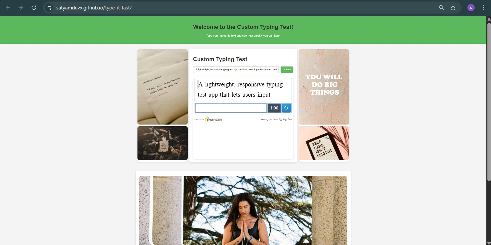

# type-it-fast
A lightweight, responsive typing test app that lets users input custom text and challenge themselves using the 10FastFingers typing widget. Built with pure HTML, CSS, and JavaScript.


# 🧠 Custom Typing Test

Welcome to the **type it fast** – a simple and responsive typing speed game where you can enter your own words and challenge yourself using a 10FastFingers embedded typing widget.

## 🚀 Live Demo
🌐 [View the Live Site](https://satyamdevx.github.io/type-it-fast/)  

---

## 📸 Preview

  


---

## 💡 Features

- ✍️ Enter your own custom text for the typing test
- 🔗 Powered by [10FastFingers Typing Widget](https://10fastfingers.com)
- 🖼️ Includes a responsive image layout with 7 photos
- 📱 Mobile-friendly design with clean UI
- ⚡ Instant test reload on form submission

---

## 🛠️ How to Use Locally

1. Clone the repository:
   ```bash
   git clone https://github.com/your-username/custom-typing-test.git

---

## 📄 License

This project is licensed under the MIT License.

---

## 🙌 Acknowledgments

- 🧩 [10FastFingers](https://10fastfingers.com) for the awesome typing widget  
- 📷 [Pexels](https://pexels.com) for the royalty-free images

